# Entrega 2-NIFI_ELK

- Alumno:  [Fco de Borja Ponz](https://github.com/fbponz)
- Docente: [Pedro Nieto](https://github.com/a10pepo)

## Enunciado entrega 2:

Usando nifi+ELK debéis presentar una solución que muestre sobre un mapa la disposición de delitos presentes en esta api:
https://data.cityofnewyork.us/Social-Services/311-Service-Requests-from-2010-to-Present/erm2-nwe9

### 1)Analisis datos de entrada:
Lo primero que vamos a realizar es analizar los datos que vamos a recibir y con qué formato los vamos a obtener. Para analizar la estructura he utilizado el programa [Postman](https://www.postman.com) Para obtener la estructura realizamos un GET sobre la siguiente dirección https://data.cityofnewyork.us/resource/erm2-nwe9.json

    [
        {
            "unique_key": "10693408",
            "created_date": "2015-10-01T00:00:00.000",
            "closed_date": "2015-10-06T00:00:00.000",
            "agency": "DOHMH",
            "agency_name": "Department of Health and Mental Hygiene",
            "complaint_type": "Rodent",
            "descriptor": "Mouse Sighting",
            "location_type": "Catch Basin/Sewer",
            "incident_zip": "10038",
            "incident_address": "59 MAIDEN LANE",
            "street_name": "MAIDEN LANE",
            "cross_street_1": "NASSAU STREET",
            "cross_street_2": "WILLIAM STREET",
            "address_type": "ADDRESS",
            "city": "NEW YORK",
            "facility_type": "N/A",
            "status": "Closed",
            "due_date": "2008-04-10T22:32:27.000",
            "resolution_description": "The Department of Health and Mental Hygiene will review your complaint to determine appropriate action. Complaints of this type usually result in an inspection. Please call 311 in 30 days from the date of your complaint for status",
            "resolution_action_updated_date": "2015-10-06T00:00:00.000",
            "community_board": "01 MANHATTAN",
            "bbl": "1000670001",
            "borough": "MANHATTAN",
            "x_coordinate_state_plane": "981968",
            "y_coordinate_state_plane": "197317",
            "open_data_channel_type": "UNKNOWN",
            "park_facility_name": "Unspecified",
            "park_borough": "MANHATTAN",
            "latitude": "40.708266",
            "longitude": "-74.0082309",
            "location": {
                "latitude": "40.708266",
                "longitude": "-74.0082309",
                "human_address": "{\"address\": \"\", \"city\": \"\", \"state\": \"\", \"zip\": \"\"}"
            }
        }
    ]

De los datos recibidos vamos a prestar especial atención a los siguientes:

1. Unique_key -> Identificador único de los datos de la llamada a 311.
2. complaint_type -> Clasificación de la llamada al 311.
3. status -> Estado actual de la incidencia.
4. agency_name -> Agencia que se encarga de gestionar la incidencia.
5. Location -> Geo-localización de la llamada al 311.

Una vez tenemos sabemos el formato los datos que vamos a recibir. Debemos Transformar los datos para que puedan ser mostrados en kibana, para ello disponemos de la siguiente documentación [Tipo datos Geo-Point](https://www.elastic.co/guide/en/elasticsearch/reference/current/geo-point.html) Vamos a utilizar la forma 1 Geo-point expresado como un objeto con las claves Lat y Lon.

Para disponer de los datos y poder guardarlos en elasticsearch debemos hacer antes las siguientes transformaciones:
1. Borrar el atributo "human_address".
2. Renombrar el atributo "longitude" a "lon".
3. Renombrar el atributo "latitude" a "lat".

Ahora que tenemos claro el concepto de lo que tenemos que realizar pasamos a detallar la propuesta técnica.

### 2)Propuesta Tecnica:

Para realizar el ejercicio se ha implementado un docker-compose que contiene los siguientes modulos ElasticSearch + Kibana + Nifi. Donde se ha dispuesto la siguiente configuración de puertos.

1. ElasticSearch -> http://localhost:9200
2. Kibana -> http://localhost:5601
3. Nifi -> http://localhost:8090

la configuración de la red está habilitada con el driver "bridge".
Para ejecutar el sistema que vamos a utilizar

    docker-compose up -d

Template NIFI en la carpeta raiz del repositorio EJ2-ELK+NIFI.xml
Template KIBANA en la carpeta kibana export.ndjson

#### 2.1)NIFI:

La parte de nifi la vamos a dividir en tres partes primero Ingestión desde la API(InvokeHTTP), la segunda parte realizaremos el transformación de los datos explicada en el apartado 1) y por ultimo explicaremos los pasos para introducirlo en ElasticSearch(PutElasticsearchHTTP).

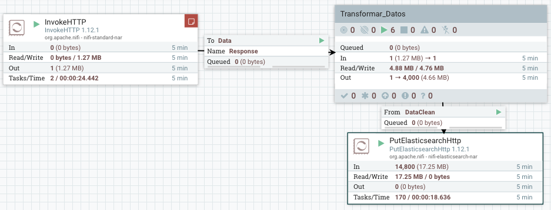

##### 2.1.1)Configuración InvokeHTTP.

Para obtener los datos dese la API se ha utilizado la siguiente configuración en el modulo invokeHTTP.

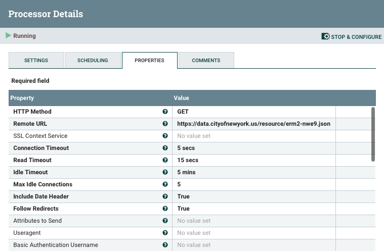
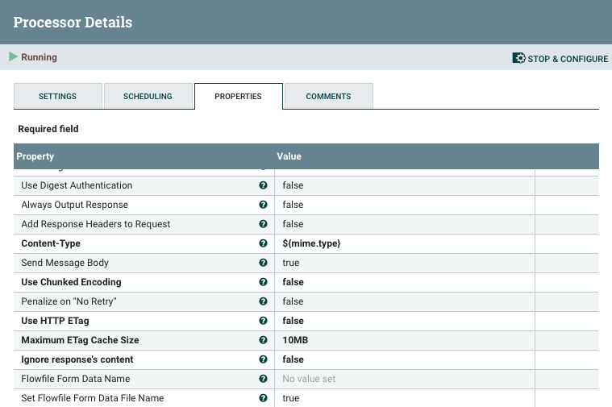

##### 2.1.2)Transformación de datos.

La transformación necesaria para ingestar los datos dentro de elastic Search la he planteado con los siguientes módulos. Primero troceamos los datos recibidos, después eliminamos la etiqueta "Human_Address" y después reemplazamos las propiedades Longitude_To_Lon y Latitude_To_Lat.

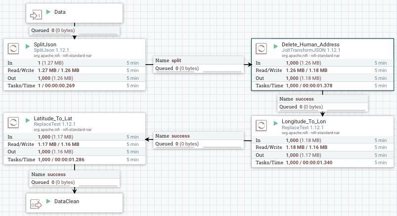

Primero Troceamos el fichero JSON, para ello hemos gastado el modulo SplitJSON con la siguiente configuración:

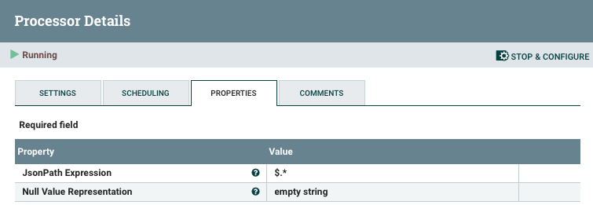

Después quitamos la etiqueta "Human_Address" para ello vamos a utilizar el procesador JoltTransformJSON con la siguiente configuración:

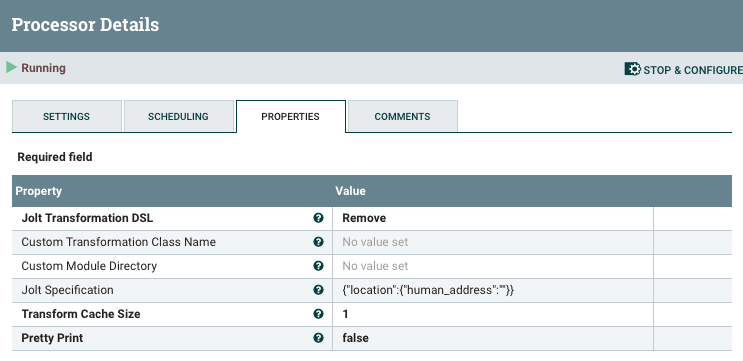

Reemplazamos la etiqueta "Longitude" por "Lon" mediante la utilización del procesador ReplaceText con la siguiente configuración:

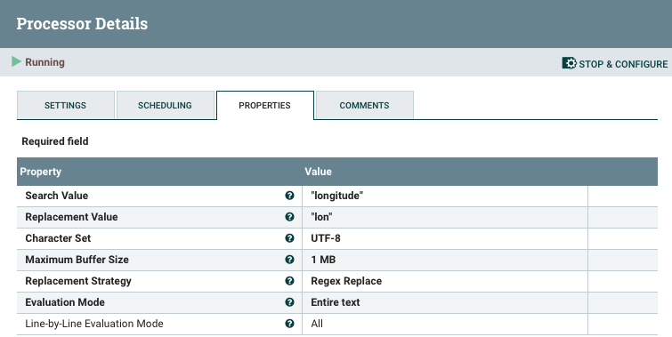

Reemplazamos la etiqueta "Latitude" por "Lat" mediante la utilización del procesador ReplaceText con la siguiente configuración:

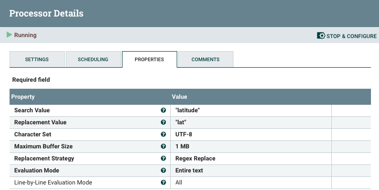

##### 2.1.3)Introducirlo en elasticSearch.

Una vez tenemos los datos tratados vamos introducirlos en elastic Search, mediante la utilización del procesador PutElasticSearch con la siguiente configuración:

El fichero template que contiene esta incluido en la carpeta "nifi" que hay dentro del repositorio.

#### 2.2) ElasticSearch:

Antes de activar los modelos de NIFI, debemos crear el índex 311calls para poder empezar a ingestar los datos sobre elasticSearch. Para crear el indice debemos de lanzar desde la terminal el siguiente comando:

    curl --silent --show-error -XPUT -H 'Content-Type: application/json' \
    http://localhost:9200/311calls \
    -d'{
        "mappings": {
            "properties": {
                "location": {"type": "geo_point"}
            }
        }
        }'

Una vez ejecutado el comando debemos obtener una respuesta como la siguiente, esto indica que se ha creado correctamente el indice.

    {"acknowledged":true,"shards_acknowledged":true,"index":"311calls"}

Podemos visualizar que realmente se ha creado correctamente el indice dirigiéndonos a la dirección de kibana y una vez dentro de la pagina web vamos a Management -> en el apartado de Elasticsearch -> Index Management y tenemos que observar algo parecido a lo que muestra la siguiente imagen.

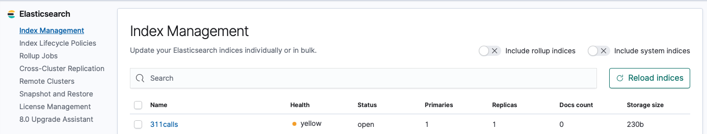

Una vez tenemos el indice creado podemos activar todos los procesadores de nifi para empezar a ingestar datos dentro de elastic search.

#### 2.2) KIBANA:

Dentro de KIBANA vamos a crear un dashboard para poder visualizar los datos que ya estamos ingestando dentro de elastic search, el dashboard que se ha planteado para esta entrega es el que muestra la la siguiente imagen, donde podemos observar que contiene 3 elementos: primero un mapa donde se mostra la geo-posición de la incidencia, por otro lado tenemos una nube de tags con las causa de la incidencias mas numerosas y otra donde se muestra las agencia que están gestionando mas incidencias. En el dashboard solo se muestran las incidencias que tienen el status en "Open", aunque se puede ver todas las incidencias simplemente eliminando la query KSQL.

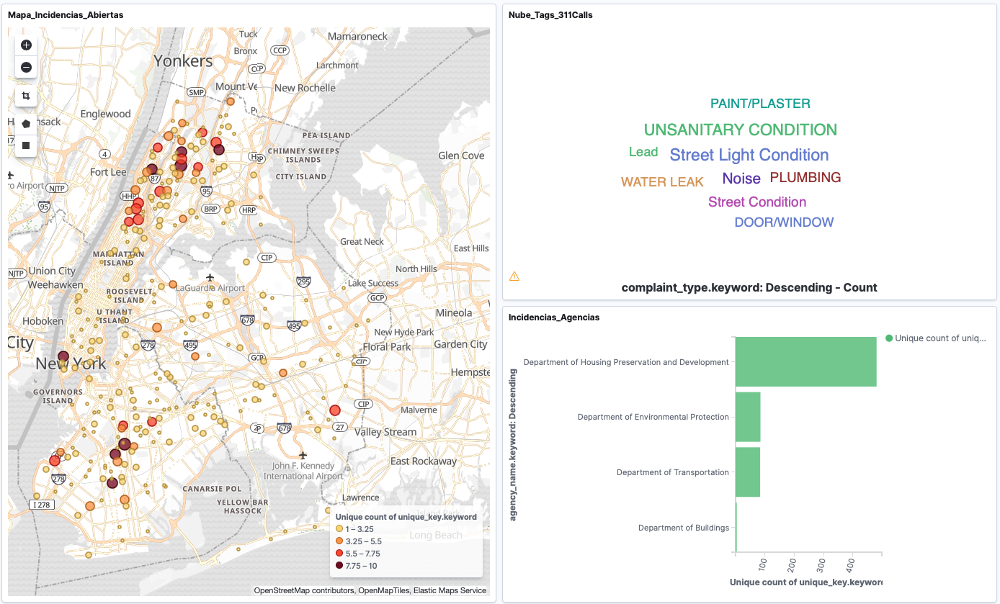

Los pasos para importar el dashboard y los elementos desarrollado son los siguientes nos dirigimos a la pestaña Management de KIBANA. En el apartado de KIBANA seleccionamos la opción de "Saved Objects" y después le damos a Import en la parte superior derecha.

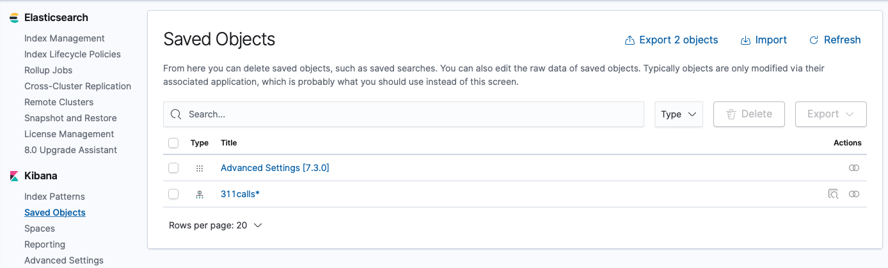

El fichero para importar la configuración se encuentran en el repositorio dentro de la carpeta de KIBANA. Una vez importado debemos observar lo que muestra la siguiente imagen.

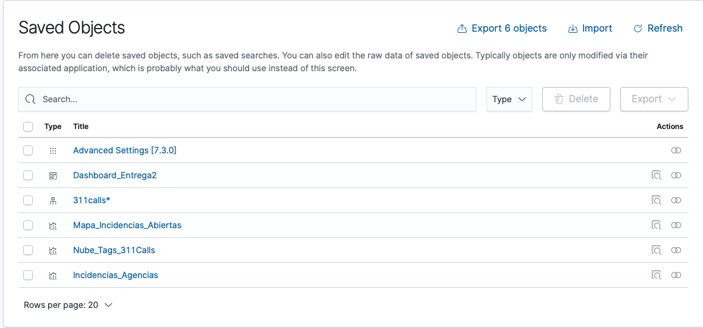

Aquí ya podemos volver al apartado de dashboard para visualizar los datos, en tiempo real.

#### 3) POSIBLE MEJORAS:

* Mejorar el sistema de petición de la API, para no ingestar datos que ya hemos metido en el sistema [enlace +info](https://dev.socrata.com/foundry/data.cityofnewyork.us/erm2-nwe9).

* Buscar una forma de simplificar en numero de procesadores de NIFI gastados para las transformación de los datos.

* Incluir nuevas ciudad como: [SanFrancisco](https://data.sfgov.org/resource/vw6y-z8j6.json), [Chicago](https://data.cityofchicago.org/resource/v6vf-nfxy.json), [Nashville](https://data.nashville.gov/resource/7qhx-rexh.json), [LosAngeles](https://data.lacity.org/resource/az43-p47q.json). 

* Modificar la forma de nombras indexar los documentos, para poder gestionar varias ciudades.

* Incluir alguna otra métrica en el dashboard de kibana.